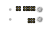

# ALTIMET02 - Precision Digital Pressure, temperature, and altimeter sensor

The [MLAB ALTIMET02](https://github.com/mlab-modules/ALTIMET02) is a high-performance pressure and temperature sensing module, based on the [MS561101BA03](https://www.te.com/usa-en/product-MS561101BA03-50.html) pressure sensor. This module is designed for use in a variety of applications, including meteorology, navigation, climate monitoring, and other scientific and industrial applications. 

 

## Specifications

The key component of the ALTIMET02 module is TE Connectivity MS561101BA03 sensor. This sensor is a highly accurate and low-power barometric sensor with a resolution of up to 10 cm. The sensor provides a 24-bit digital output via the I2C or SPI interfaces, allowing for easy integration with various microcontrollers.

### Parameters

* Pressure and Temperature measurement
* Pressure resolution: 10 cm
* Temperature resolution: 0.01°C
* Communication interface: I2C and SPI
* Supply voltage: 1.8V to 3.6V
* Power consumption: Low (<1uA during measurement)
* Full-scale pressure range: 10 - 1200 mbar
* Operating temperature range: -40 to +85 °C
* High reliability and long-term stability
* Advanced error compensation
* Enhanced EMI Protection

## Use Cases

The ALTIMET02 module is primarily designed as a pressure-sensing device for scientific experiments like statospheric balloons, but its capabilities extend far beyond this purpose. With high accuracy and low power consumption, the module is ideal for a wide range of applications.

### Atmospheric pressure and meteorological applications

As an atmospheric pressure sensor, ALTIMET02 is extremely suitable for meteorological applications. The module can be used for tracking pressure changes over time, which can provide valuable data for weather prediction. The combination of pressure and temperature measurements can help create a more detailed picture of atmospheric conditions.

### Altimetry and navigation

Altitude measurement is another key area where ALTIMET02 excels. Altitude measurement can be done using the barometric method, which uses the change in atmospheric pressure with altitude. This is useful for various types of navigation, including hiking, aviation, and marine navigation.

### Climate monitoring and scientific applications

ALTIMET02 is also a tool for scientific and industrial applications where it is important to monitor changes in climatic conditions. The module can be, for example, used in the field of scientific research to study climate change or in industry for monitoring and controlling conditions in various environments, such as greenhouses, warehouses, and production halls.

### Low power consumption applications

Due to its low power consumption, ALTIMET02 is suitable for applications that require long-term monitoring without frequent charging or battery replacement. This can include remote weather stations, animal trackers, or other portable devices.

## Connection to Microcontroller

The ALTIMET02 module can be easily connected to a microcontroller via the I2C or SPI interfaces.

For connecting the module to a microcontroller via the I2C interface, it is necessary to connect SDA (data line) and SCL (clock line) to the corresponding pins on the microcontroller.

For connection via the SPI interface, it is necessary to connect CSB (chip select), SDO (serial data output), SDI (serial data input), and SCLK (serial clock) to the corresponding pins on the microcontroller.

## Conclusion

The ALTIMET02 module is a highly accurate and low-power pressure and temperature

 sensing module, ideal for various applications. Its simple interface and small size allow for easy integration into any project. Its wide range of uses makes it an ideal solution for many different applications. For further information, please refer to the [ALTIMET02](https://github.com/mlab-modules/ALTIMET02) and the [MLAB website](https://www.mlab.cz/).
